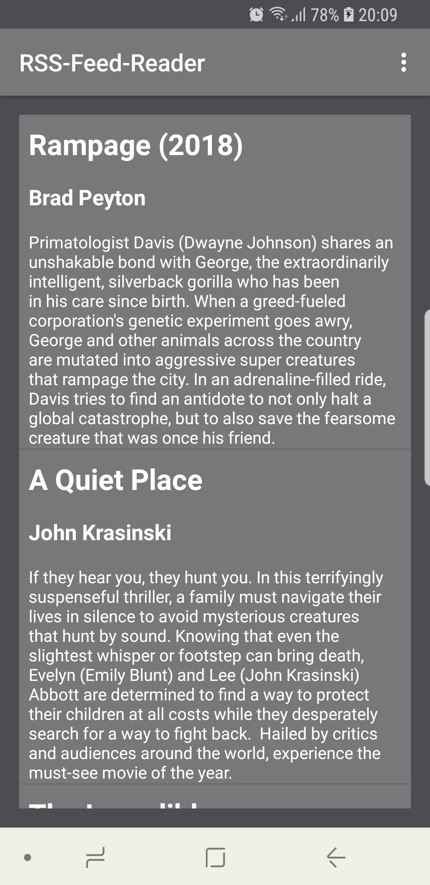
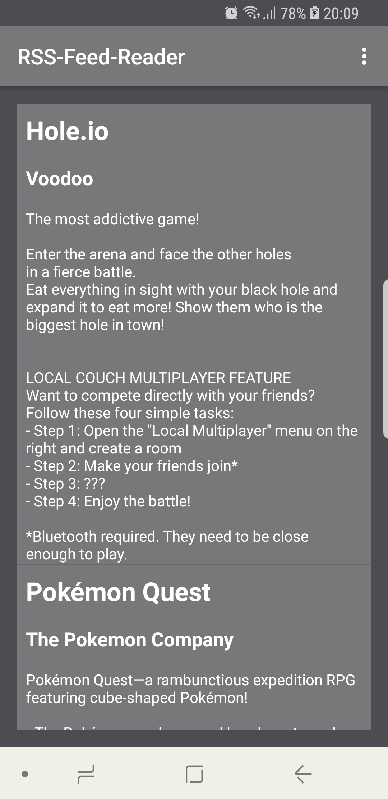
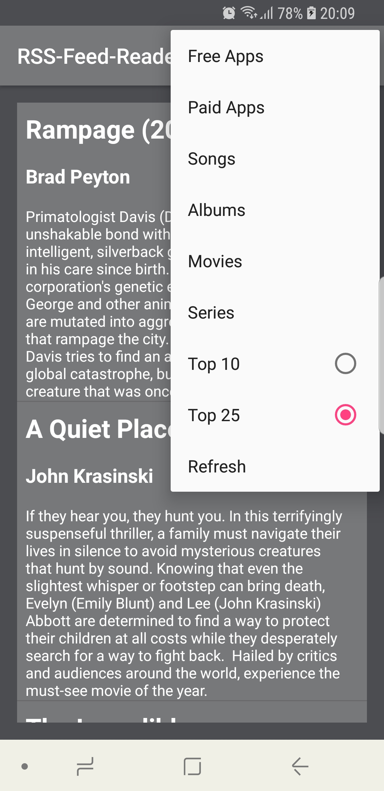

# RSSFeedReader using the Apple RSS Feed

This is a simple demo app that displays a RSS feed of several categories, using data from the [Apple Information Feed](https://www.apple.com/rss/). This app is a mainly a tutorial from the Udemy Class: Android Java Masterclass - Become an App Developer.

The app downloads the raw XML data from the Apple feed, then parses the data to display the information in a ListView.

The app also utilises a dropdown menu to switch between categories.

**Screenshots from the RSSFeedReader:**

  

**Note:**
This app is only used for educational purposes of programming practice.
